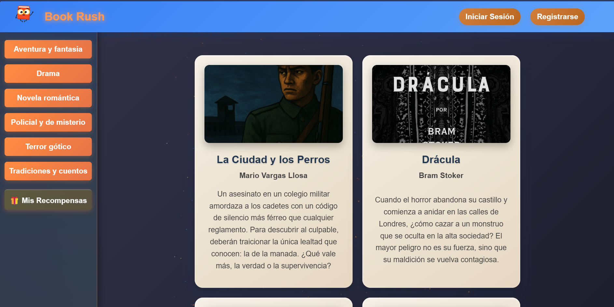
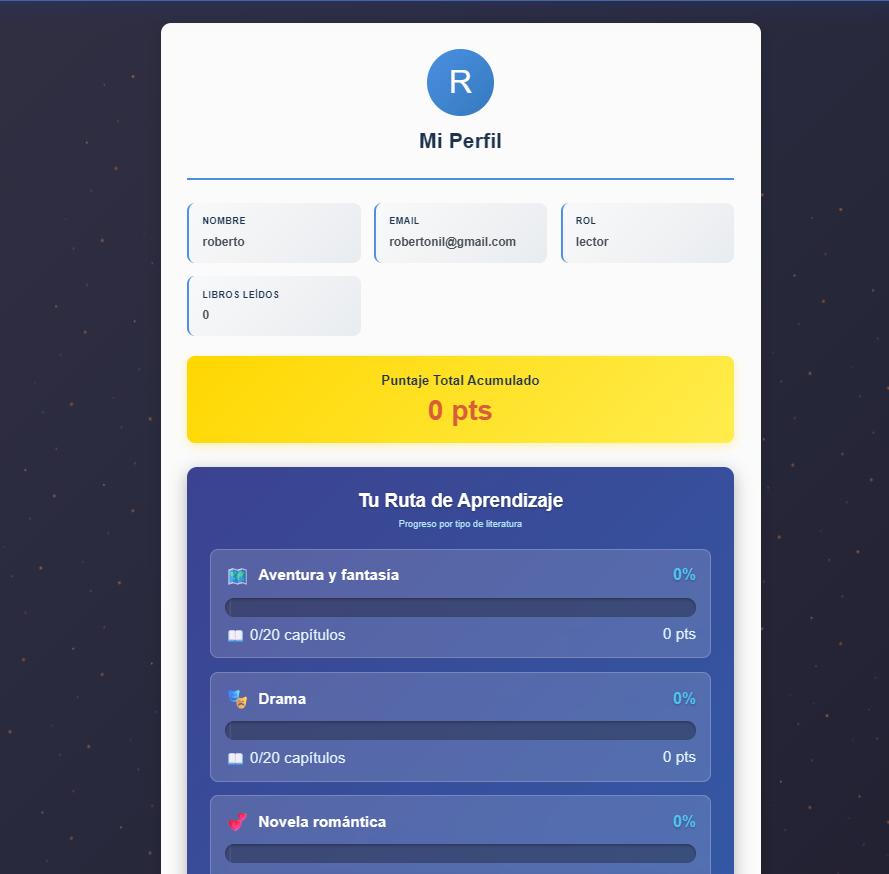
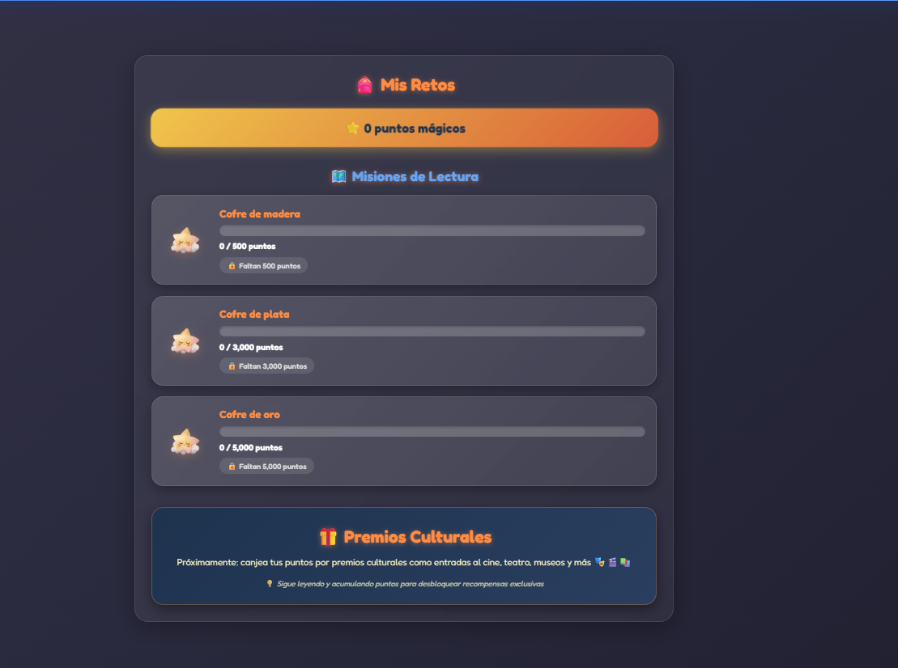

# 📚 Book Rush

Aplicación web interactiva tipo Kahoot para evaluar comprensión lectora mediante preguntas basadas en capítulos de cuentos.

---

## 🚀 Funcionalidades
- Lectura por capítulos
- Preguntas tipo quiz
- Sistema de puntaje
- Login con roles (admin / usuario)
- CRUD de contenido

---

## 🛠️ Tecnologías
HTML, CSS, JavaScript, PHP, MySQL

----
## 📸 Vista previa

---

## ⚙️ Cómo ejecutar
1. Clonar repo
2. Importar /database/book_rush.sql
3. Ejecutar en XAMPP
